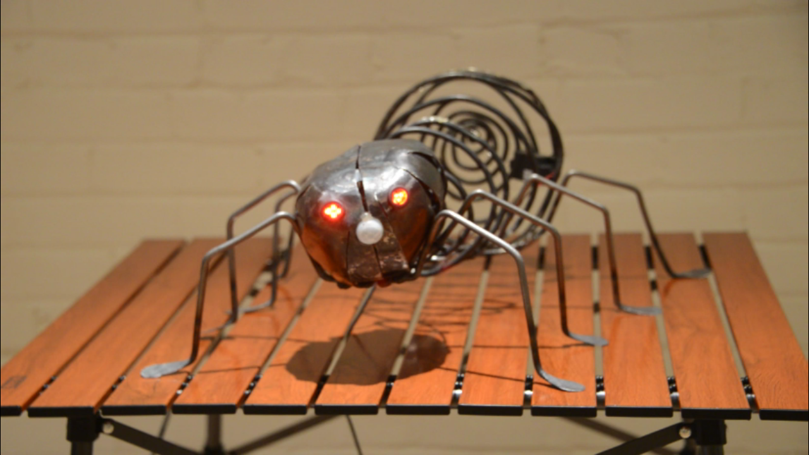

# Heavy Metal Hollywood Spider


The **Spider** project is a fusion of two current interests:
* Art Metal class
* Raspberry Pi and related hardware software.

As with the  ("paxnews"), the project grew organically. That is I only had a rough idea how it would all look at the end but progresson was consistent over a number of months. You could say that, he is an organic spider (best kind!).

## Components:
* Raspberry Pi Zero W
* Eyes: 2 clusters of 4 RGB LEDs
* Adafruit I2S 3W Stereo Speaker Bonnet for Raspberry Pi
  * includes 2 speakers 
* PIR sensor
* LED string (white)

## Spider Construction
The spider grew "organically" over two semesters of the **Art Metal** class held at  in the body shop workshop, under the auspices of the  (Toronto District School Board). [Thanks to Phil and Toby for their guidance.]

## General Operations
The spider sensor resides in the nose and detects motion from pets/humanoids up to 5 metres away (<a href="https://www.adafruit.com/product/189" target="_blank">possibly works on zombies, not guaranteed</a>).  
On detection:
* Spider goes on alert: The cyan eyes and body lights start flashing rapidly.
* Spider gets angry: The red eyes then transition up to full brightness.
* Spider emits warning noises: A short sound clip plays repeatedly until the pet/humanoid/zombie goes out of range.
* All clear, Spider goes back to sleep: The red eyes then transition down.
* Spider dozing: The cyan eyes and body lights twitch every few seconds.

### Spider video


(Click and review the  in a separate window.).

### Schematic
See 

## Operations
Start spider with _crontab_:
```
@reboot rm -f /home/pi/python/spider/ospid.txt # JOB_ID_1; Remove pid file to prevent mulitiple incursions of spider.
@reboot sleep 2 && ~pi/run_spider.sh # JOB_ID_2; start spider.
```

## FAQ
Q: Why _Hollywood_?  
A: Well, we... the spider and me... live on Hollywood Cres.

***
Ron Grimes  
Toronto  
Started:     January 2019  
Last Update: June 2020  
